#  Geo Detectives
Geo Detectives is a child-friendly geography quiz where players test their world knowledge by answering timed questions about countries, capitals, and landmarks.  
Built with HTML, CSS, and JavaScript, the project uses the Open Trivia Database API to generate fun, educational challenges for children aged 7–12.

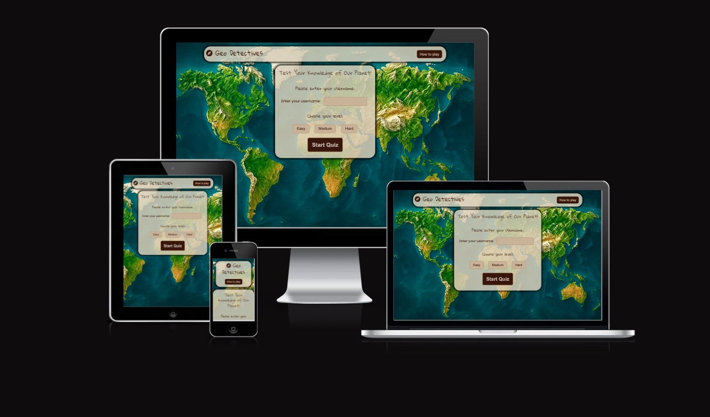

## Rationale
Geo Detectives was created to transform geography learning into an engaging, playful, and accessible experience for children. After completing my first project, Bond, which focused on emotional wellbeing, creativity, and self-expression for young learners, I wanted to extend this idea into the academic world  specifically into a subject that many children often find challenging or boring: geography.

Children can struggle with memorising capitals, countries, landmarks, and world facts because traditional learning relies heavily on textbooks and rote memorisation. Geo Detectives aims to solve this by turning learning into a fun, game-based experience that encourages exploration and curiosity rather than pressure. Instead of reading long information, children answer small, clear, bite-sized questions that help build general knowledge step-by-step.

This project was inspired by the belief that learning becomes more meaningful when it feels like an adventure. Each question encourages children to think like detectives, observing clues, making predictions, and discovering something new. With every correct answer, their confidence grows; with every new question, their curiosity deepens.

The visuals, colour palette, and world-map background create an immersive atmosphere that helps children stay focused without distraction. The simple layout, timed questions, and clean buttons make the quiz accessible even for younger learners or those who need structure to stay engaged.

As a parent, I understand how important it is to have tools that are safe, educational, and easy to use. My own children have been playing the quiz many times throughout the development process, and it has been amazing to see how quickly they learned new world facts, from capitals to famous landmarks and countries they had never heard of before. Watching them improve, get excited about their scores, and proudly share new information with me has been a big motivation for completing this project.

## User Goals
- Children want fun and challenging questions that can challenge their knowledge about geography subject.
- Teachers want a tool that’s easy and fun to use in classrooms which create competition within the classroom students by saving palyers scores.
- Clear instructions written in plain English.
- Relevant questions in the quiz.
- To have the chance to share feedback or suggestions about the game experience.
- To experience a fair and transparent scoring system that reflects performance accurately.

  ## User Stories
| User | User Story | Task |
|----|-------------|-----------------------------|
| As a child/student| I want to play quiz with timer & levels to chalange my knowledge about geography subject| Start, choose level, timed question rotation |
| As a user | I want the score system to be transparent| Display the total score at the end of the game |
| As a user| I want the game to be tempting me to play again and get a better score | End-of-quiz encouraging message and button asking me to play again to get a better score|
| As a user | I want the instructions to be clear, concise and easily accessible| How to play button |
| As a user | I want to receive immediate feedback on my quiz answers| Display a message at the end of the quiz to tell user how they did and encourge them to try again| 

## Targeted Audience
School children (Primary and secondary) who are developing their understanding of continents, countries, and landmarks in an engaging format.
Teachers  looking for a quick, classroom-ready geography quiz that encourages curiosity and teamwork.
Casual learners or quiz enthusiasts who enjoy testing their general knowledge about the world through timed challenges.

## Wirefrmes
Before starting the development of Geo Detectives, I created detailed wireframes using [Balsamiq Wireframes](https://balsamiq.com/) to plan the structure and layout of the website.
These visual mockups helped me organise each section — from the home screen and quiz layout to the results and feedback screens — ensuring a simple and child-friendly experience across all devices.

 
 
. 

## Design Choices
### Typography

To keep the design fun yet readable for children, I used [Google font](https://fonts.google.com/selection) and I selected two Google Fonts that balance playfulness and clarity:
 - Gloria Hallelujah (used for headings and quiz titles).
This handwritten font adds a creative, adventurous tone that feels inviting to younger users. It captures the personality of a child’s travel notebook or explorer’s journal, which fits the Geo Detectives theme.

- Poppins (used for body text, buttons, and feedback messages).
A clean, modern sans-serif that ensures easy readability across devices and screen sizes. Its round, friendly letter shapes make it visually compatible with Gloria Hallelujah.

### Colour Palette

The Geo Detectives colour scheme is inspired by map background image, I used [Coloors Image Picker](https://coolors.co/image-picker). This tool helped me combines warm earthy tones with bright highlights to create a balanced, child-friendly interface.
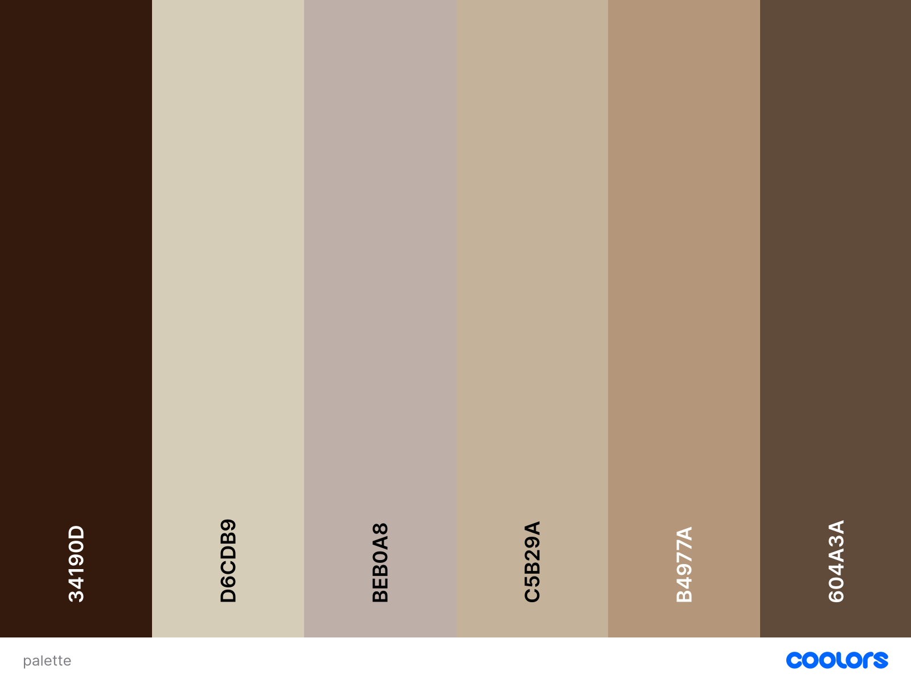

I have also used [Contrast Grid](https://contrastgrid.com/?xAxisData=%255B%257B%2522color%2522%253A%2522%252334190D%2522%257D%252C%257B%2522color%2522%253A%2522%2523D6CDB9%2522%257D%252C%257B%2522color%2522%253A%2522%2523C5B29A%2522%257D%252C%257B%2522color%2522%253A%2522%2523B4977A%2522%257D%252C%257B%2522color%2522%253A%2522%2523BEB0A8%2522%257D%252C%257B%2522color%2522%253A%2522%2523604A3A%2522%257D%255D) to get inspiration for possible colour combination to make the website visually appealing.

| CSS Name                 | HEX       | Comment                                                                       |
| ------------------------ | --------- | ----------------------------------------------------------------------------- |
|     --deep-earth-brown   |  #34190D  | headings and font colour.                                                     |
|     --sand-beige         |#D6CDB9    |  quiz box background.                                                         |
|     --warm-taupe         | #C5B29A   | secondary background color                                                    |
|     --desert-clay        | #B4977A   |buttons and highlights                                                         |
|     --walnut-brown       | #604A3A   | footer background and subheading font colour                                  |
|    --pale-stone          | #BEB0A8   | body background / borders colour                                              |
| Other Colors CSS Hex     |           |                                                                               |
|     --wrong-answer-red   | #ff3333   | Color for wrong answer button                                                 |
|     --right-answer-green | #51BF83   | Color for correct answer button, color for check icon                         |

### Images

I Generated the Background image from [ChatGPT](https://chatgpt.com/).It is a  world map used as the website’s background to reflect the theme of exploration and geography. 

### Responsiveness

My website is responsive to different layouts depending on the size of the viewport have been included in the CSS media queries. This allows visitors to experience the website as I intended on device types and screen sizes. The breakpoints I am using are from Bootstrap.

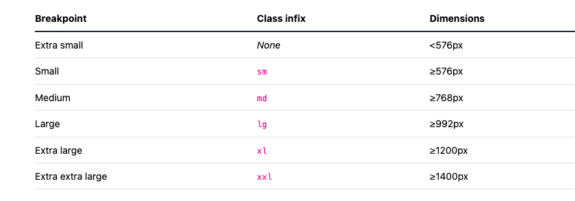

## Features

Layout is easy to use and adheres to the best practices in formatting and styling. Players can easily navigate between questions.
With a countdown timer, multiple-choice questions and real-time feedback on right and wrong responses, the quiz offers users an engaging experience. This interactive feature increases user engagement and motivates users to take knowledge tests.

### Existing Features
1. Header section

  - Display the website title "Geo Detectives" using a child-friendly font.
  - Includes a " How yo play" button that toggles a slide-down instruction box.
  - Fully responsive across screens.
      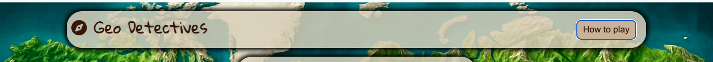

2. How to Play with a sliding instructions Box

  - A hidden instruction panel that appears when the user clicks “How to Play”
  - Provides simple, clear steps explaining how the quiz works.
  - Helps children understand the rules without overwhelming them.
  - Uses smooth show/hide logic for a better user experience.
      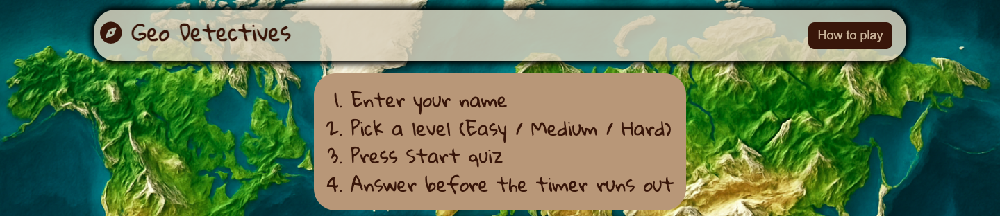
    
3. Welcome message & the quiz form

  - Friendly introductory message: “Test Your Knowledge of Our Planet!”
  - A username input field to personalise gameplay.
  - Form validation ensures the username is entered before starting the quiz
  - Three difficulty buttons connected to the Open Trivia Database.
  - Buttons become highlighted when selected (active state).
  - Difficulty determines the complexity of questions fetched.
  - Designed to help children choose a level matching their confidence.
  - Begins the quiz only when a username is entered and difficulty level is selected
  - Displays a loading animation before the questions appear.
      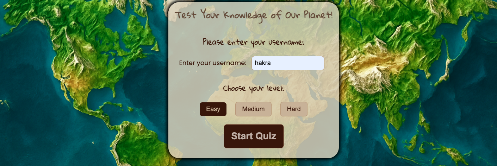
      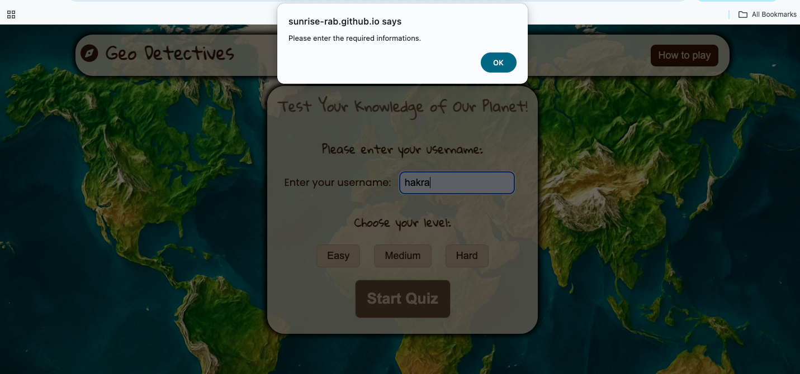

 4. Display loader
  -  It is added to remove any empty display of question box while content is being loaded from [Open Trivia db]("https://opentdb.com/" "Open Trivia db").
       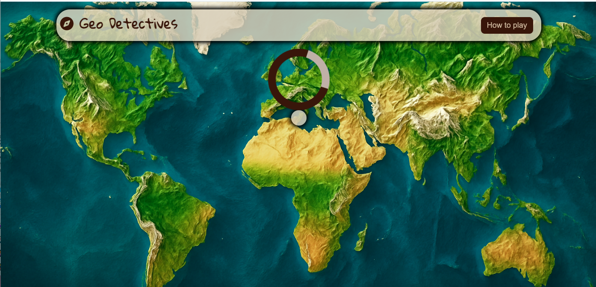

 4. Dynamic question area with a timer and incremented right and wrong score 

  - Displays questions from OpenTriviaDB in a clean and readable format.
  - Correct and incorrect answers are automatically shuffled.
  - Answer buttons update for each question.
  - Buttons lock after a selection to prevent repeated answers.
  - Shows progress Helps users track how many questions remain.
  - Positioned on the left for better balance with the timer.
  - A live 20-second timer for each question.
  - Automatically moves to the next question when time runs out.
  - Timer is positioned on the right to balance layout.
  
     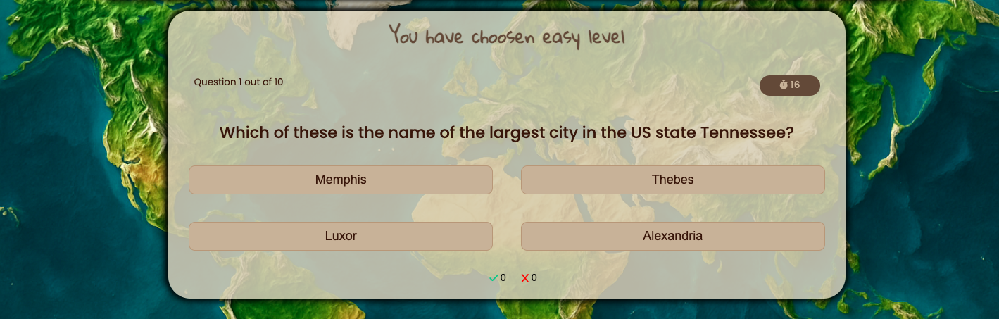 
- Displays Correct answers and Incorrect answers which Updates immediately after each question, this Helps children understand their progress and keep motivated.
     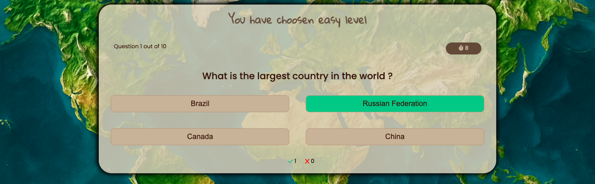 
    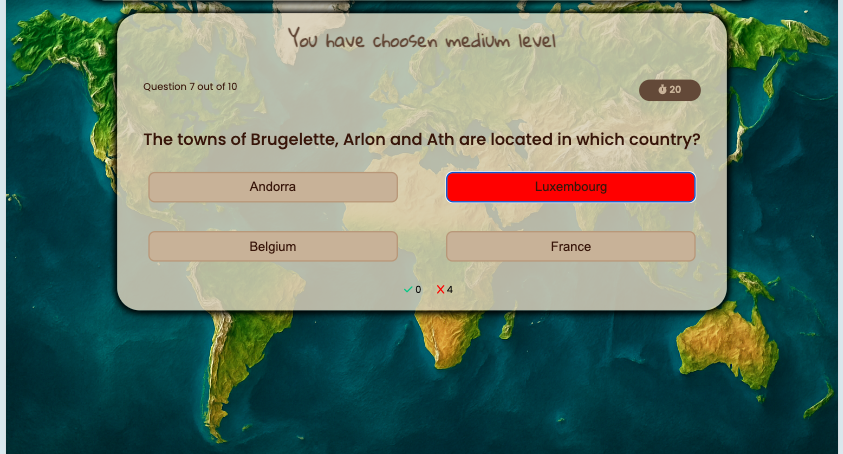
    
5. Responsive Design

   - Functional on Mobile phones, Tablets and Desktop screens.
   - Layout rearranges for smaller screens for easy readability.

     

 6. End-Quiz Summary Page

   - Shows the final score out of 10.
   - Motivational message encouraging the player.
   - Includes a “Play Again” button which resets scores, clears username, clears selected difficulty and brings the user back to the starting screen
      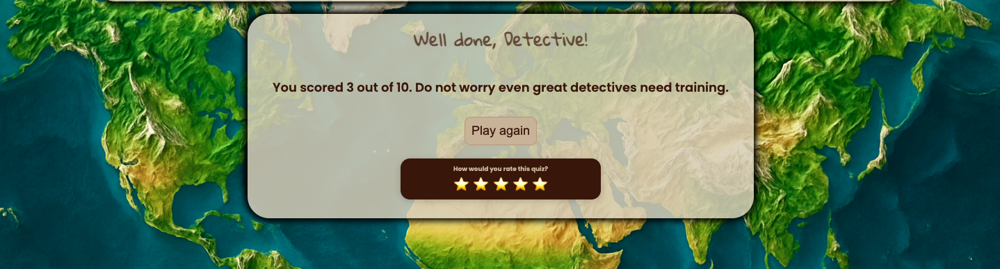
     
 7. Clean & Child-Friendly Styling

   - Soft colour palette inspired by natural earth tones.
   - Rounded containers and gentle shadows for a friendly feel.
   - Calm world-map background that stays blurred for readability.
   - Clear, easy-to-read fonts designed for children.
  

### Future Enhancements

* Display the correct answer after the user chooses his answer.
* Multiple player option.
* Add a leaderboard that includes all players'scores.
* Share results on Social Media. 
* At the end of the quiz list all the correct answers and the user answers.
* Provide hints or additional resources for challenging questions.

[Back to top](#contents)

## Technologies Used

### Languages
- [HTML](https://developer.mozilla.org/en-US/docs/Glossary/HTML5 "HTML")
- [CSS](https://developer.mozilla.org/en-US/docs/Web/CSS "CSS")
- [JS](https://developer.mozilla.org/en-US/docs/Web/JavaScript "JS")

### Libraries & Framework

- [Google Fonts](https://fonts.google.com/ "Google Fonts")
- [Favicon](https://favicon.io/ "Favicon")

### Tools

- [GitHub](https://github.com/ "GitHub")
- [Balsamiq](https://balsamiq.com/wireframes/ "Balsamiq")
- [Image Resize](https://squoosh.app/)
- [Color Contrast](https://contrastgrid.com/)
- [Open Trivia DB](https://opentdb.com/ "Open Trivia DB")
- [Colour Palette](https://coolors.co/)
- W3C HTML Validation Service](https://validator.w3.org/ "W3C HTML")
- [W3C CSS Validation Service](https://jigsaw.w3.org/css-validator/ "W3C CSS")
- [JSHint](https://jshint.com/ "JSHint")
- [TOC Generator](https://ecotrust-canada.github.io/markdown-toc/ "TOC Generator")
- [Am I Responsive](https://ui.dev/amiresponsive "Am I responsive")
- [Responsive Design Checker](https://responsivedesignchecker.com/ "Responsive Design Checker")
- [WAVE Accessibility Tool](https://wave.webaim.org/ "WAVE Accessibility Tool")
- [Color Contrast Accessibility Validator](https://color.a11y.com/ "Color Contrast Accessibility Validator")

## Testing

### Code Validation

#### HTML

I have used [W3C HTML Validation Service](https://validator.w3.org/ "W3C HTML"). I tested the html file. It displays no errors.

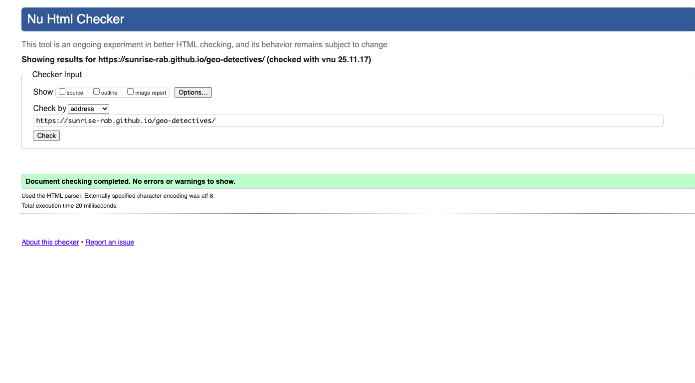

[Back to contents](#contents)

### CSS

CSS code for the webpage was validated on [W3C CSS Validation Service](https://jigsaw.w3.org/css-validator/ "W3C CSS Validator"). It displays no errors

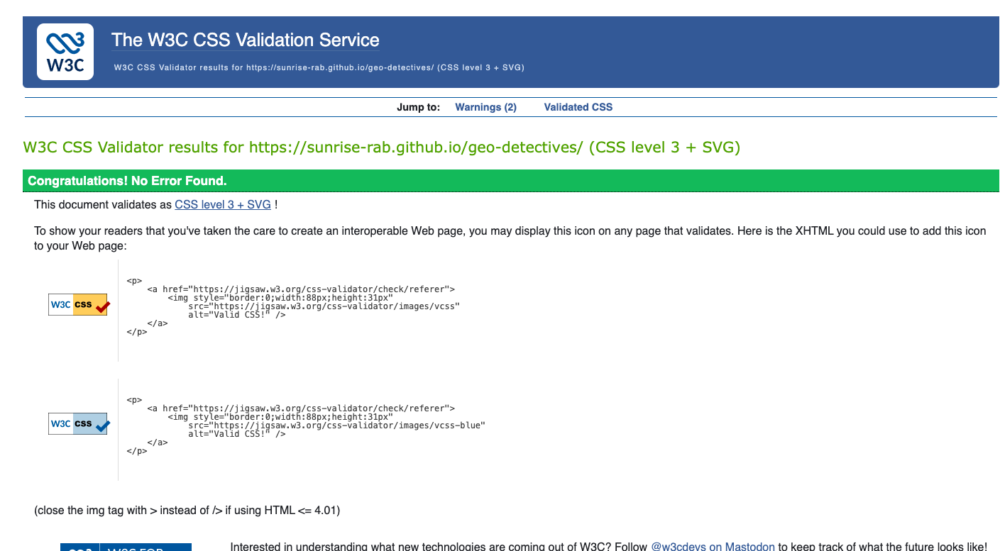

[Back to contents](#contents)

### JavaScript

JS code was validated on [JSHint](https://jshint.com/ "JSHint"). some warnings were identified and they have been fixed.

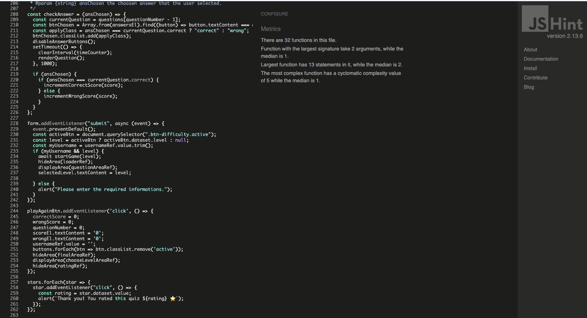

[Back to content](#contents)

## Deployment

Geo detectives was deployed early in the process to GitHub pages via the following steps:

- Navigate to the repository on GitHub and click on Settings.
- In the side navigation and select Pages.
- In the None dropdown and choose Main.
- Click on the Save button.
- The website is now live at https://sunrise-rab.github.io/geo-detectives/index.html.

Any changes required to the website, they can be made, committed and pushed to GitHub.

### Fork the project
Forking the GitHub repository allows you to create a duplicate of a local repository. This is done so that modifications to the copy can be performed without compromising the original repository.

- Log in to GitHub.
- Locate the repository.
- Click to open it.
- The fork button is located on the right side of the repository menu.
- To copy the repository to your GitHub account, click the button.
  Now you have your own version you can commit, edit, and even make pull requests to the original project.
  
  ### To clone the project
- Log in to GitHub.
- Navigate to the main page of the repository and click Code.
- Copy the URL for the repository.
- Open your local terminal or VS Code.
- Change the current working directory to the location where you want the cloned directory.
- Type git clone, and then paste the URL you copied earlier.
- Press Enter to create your local clone.

## Credits

  

