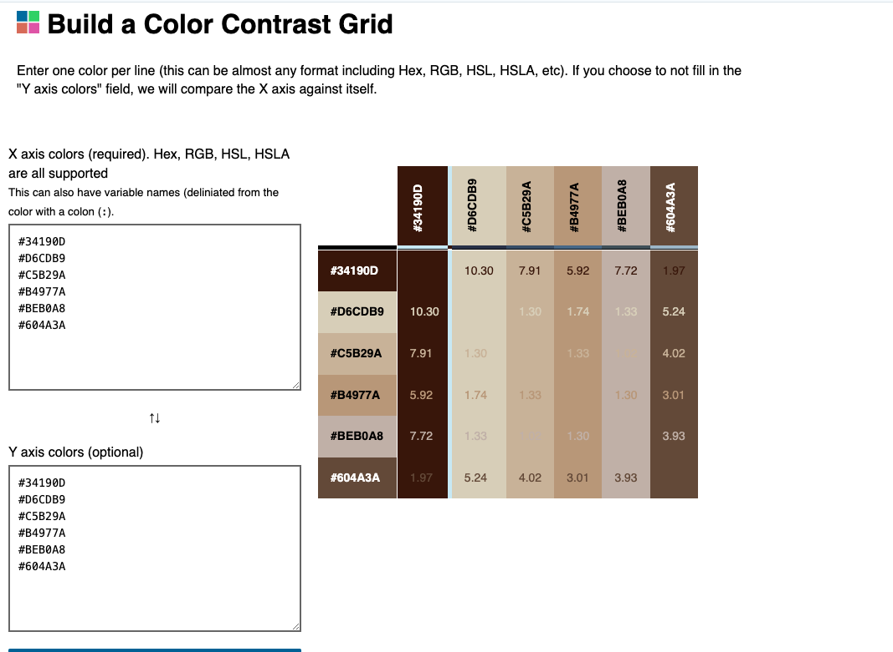

#  Geo Detectives
Geo Detectives is a child-friendly geography quiz where players test their world knowledge by answering timed questions about countries, capitals, and landmarks.  
Built with HTML, CSS, and JavaScript, the project uses the Open Trivia Database API to generate fun, educational challenges for children aged 7–12.

## Rationale
Geo Detectives was created to make geography learning interactive and exciting for children.  
It extends the ideas of my previous project, Bond, by combining creativity, curiosity, and education through gameplay.

## User Goals
- Children want fun and challenging questions that can challenge their knowledge about geography subject.
- Teachers want a tool that’s easy and fun to use in classrooms which create competition within the classroom students by saving palyers scores.
- Clear instructions written in plain English.
- Relevant questions in the quiz.
- To have the chance to share feedback or suggestions about the game experience.
- To experience a fair and transparent scoring system that reflects performance accurately.

  ## User Stories
| User | User Story | Task |
|----|-------------|-----------------------------|
| As a child/student| I want to play quiz with timer & levels to chalange my knowledge about geography subject| Start, choose level, timed question rotation |
| As a parent/teacher/ student | I want to be able to easily contact content creators for feedback or changes. |  Feedback form |
| As a user | I want the score system to be transparent| Display the total score at the end of the game |
| As a user| I want the game to be tempting me to play again and get a better score | End-of-quiz badges and button asking me to play again to get a better score|
| As a user | I want the instructions to be clear, concise and easily accessible| Help and instructions button |
| As a user | I want to receive immediate feedback on my quiz answers| Display a message at the end of the quiz to tell user how they did and encourge them to try again| 

## Targeted Audience
School children (Primary and secondary) who are developing their understanding of continents, countries, and landmarks in an engaging format.
Teachers  looking for a quick, classroom-ready geography quiz that encourages curiosity and teamwork.
Casual learners or quiz enthusiasts who enjoy testing their general knowledge about the world through timed challenges.

## Wirefrmes
Before starting the development of Geo Detectives, I created detailed wireframes using [Balsamiq Wireframes](https://balsamiq.com/) to plan the structure and layout of the website.
These visual mockups helped me organise each section — from the home screen and quiz layout to the results and feedback screens — ensuring a simple and child-friendly experience across all devices.

 
 
. 

## Design Choices
### Typography

To keep the design fun yet readable for children, I used [Google font](https://fonts.google.com/selection) and I selected two Google Fonts that balance playfulness and clarity:
 - Gloria Hallelujah (used for headings and quiz titles).
This handwritten font adds a creative, adventurous tone that feels inviting to younger users. It captures the personality of a child’s travel notebook or explorer’s journal, which fits the Geo Detectives theme.

- Poppins (used for body text, buttons, and feedback messages).
A clean, modern sans-serif that ensures easy readability across devices and screen sizes. Its round, friendly letter shapes make it visually compatible with Gloria Hallelujah.

### Colour Palette

The Geo Detectives colour scheme is inspired by map background image, I used [Coloors Image Picker](https://coolors.co/image-picker). This tool helped me combines warm earthy tones with bright highlights to create a balanced, child-friendly interface.

I have also used [Contrast Grid](https://contrastgrid.com/?xAxisData=%255B%257B%2522color%2522%253A%2522%252334190D%2522%257D%252C%257B%2522color%2522%253A%2522%2523D6CDB9%2522%257D%252C%257B%2522color%2522%253A%2522%2523C5B29A%2522%257D%252C%257B%2522color%2522%253A%2522%2523B4977A%2522%257D%252C%257B%2522color%2522%253A%2522%2523BEB0A8%2522%257D%252C%257B%2522color%2522%253A%2522%2523604A3A%2522%257D%255D) to get inspiration for possible colour combination to make the website visually appealing.

  

